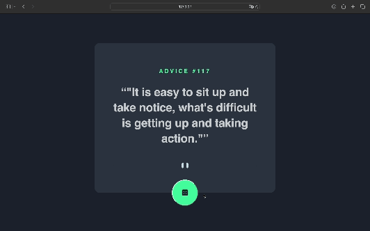

# Frontend Mentor - Advice generator app solution

This is a solution to the [Advice generator app challenge on Frontend Mentor](https://www.frontendmentor.io/challenges/advice-generator-app-QdUG-13db). Frontend Mentor challenges help you improve your coding skills by building realistic projects.

## Table of contents

- [Overview](#overview)
  - [The challenge](#the-challenge)
  - [Screenshot](#screenshot)
  - [Links](#links)
- [My process](#my-process)
  - [Built with](#built-with)
  - [What I learned](#what-i-learned)
  - [Continued development](#continued-development)
  - [Useful resources](#useful-resources)
- [Author](#author)
- [Acknowledgments](#acknowledgments)

## Overview

### The challenge

Users should be able to:

- View the optimal layout for the app depending on their device's screen size
- See hover states for all interactive elements on the page
- Generate a new piece of advice by clicking the dice icon

### Screenshot

### Links

- Solution URL: [frontendmentor_solution](https://www.frontendmentor.io/solutions/advice-generator-app-0qurvzBOmu)
- Live Site URL: [live_advicegenerator](https://audreyfabiola.github.io/Advice-Generator-App/)

## My process

I first initiated the challenge by creating the HTML structure to define the content and layout of the webpage. Then. I worked on the CSS stylesheets to match the visualization and layout of the webpage according to the requirements of the challenge. Lastly, I worked on the JS to manipulate the button functions and generate advices according to the challenge.

### Built with

- HTML
- CSS
- JavaScript

### What I learned

Through this challenge, I was able to recall the HTML, CSS, and JS lessons that I had previously studied in the HCI course in semester 1.

### Continued development

I will use the lessons recalled for my future project during the WADS course. 

### Useful resources

- [YouTube](https://www.youtube.com) - YouTube video have acted as a guidance throughout doing the challenge. 
- [w3schooks](https://www.w3schools.com) - This website has helped me if I came across functions I wasn't familiar with or needed recollection.

## Author

- Frontend Mentor - [@audreyfabiola](https://www.frontendmentor.io/profile/audreyfabiola)

## Acknowledgments

To refresh my memories about html, css, and js, I decided to follow a YouTube tutorial as a guide for the assignment.
Link to the YouTube tutorial that I followed: https://www.youtube.com/watch?v=SjjmHNdE32Y
